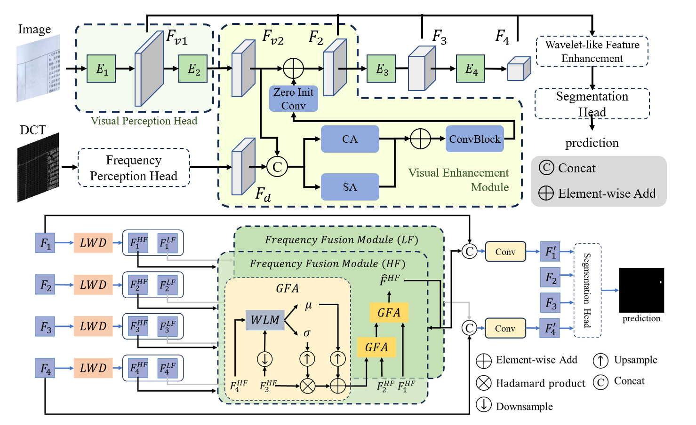

# Enhancing Tampered Text Detection through Frequency Feature Fusion and Decomposition

We introduce a Feature Fusion and Decomposition Network (FFDN) that combines a Visual Enhancement Module (VEM) with a Wavelet-like Frequency Enhancement (WFE). The VEM makes tampering traces visible while preserving the integrity of original RGB features using zero-initialized convolutions. Meanwhile, the WFE decomposes the features to explicitly retain high-frequency details that are often overlooked during downsampling, focusing on small but critical tampering clues.

# Prepare Dataset

1. download the dataset from [DocTamper](https://github.com/qcf-568/DocTamper)
2. Link the dataset to `./data/DocTamperV1/unzip_files.`

Your folder structure should look like this:
```text
data
└── DocTamperV1
    ├── unzip_files
    │   ├── DocTamperV1-TrainingSet
    │   ├── DocTamperV1-TestingSet
    │   ├── DocTamperV1-FCD
    │   └── DocTamperV1-SCD
    ├── pks
    │   ├── DocTamperV1-TestingSet_75.pk
    │   ├── DocTamperV1-FCD_75.pk
    │   └── DocTamperV1-SCD_75.pk
    └── processed
        ├── train.txt
        ├── val.txt
        ├── fcd.txt
        └── scd.txt

```

# Getting Started
## Installations

To install FFDN, follow these steps:

```bash
# install jpegio
cd FFDN/libs/jpegio
pip install -r requirements.txt
python setup.py install
# install mmsegmentation
cd ../../
pip install -r requirements.txt
```

### Inference

Run the demo in [inference.ipynb](tools%2Finference.ipynb)

### Train and Evaluate

```bash
export GPU_NUMS=4
export PRETRAINED_MODEL=work_dirs/FFDN/FFDN.pth

bash tools/dist_train_val.sh work_config/FFDN/FFDN.py ${GPU_NUMS}
bash tools/dist_test_docTamper_lmdb.sh work_config/FFDN/FFDN.py ${PRETRAINED_MODEL} ${GPU_NUMS}
```

# Note
For fair comparison, we replace 3 times compression with 1 time compression, because the Doctamper project actually compresses 1 time due to a code implementation error. For more details, please refer to [jpeg_compress_vis.ipynb](tools%2Fjpeg_compress_vis.ipynb).

# Acknowledgement

This project builds upon several open-source projects and datasets:

[MMDetection](https://github.com/open-mmlab/mmsegmentation): We leverage the MMSegmentation framework for our model implementation and training pipeline. Their modular design and extensive tools greatly facilitated our research.

[DocTamper](https://github.com/qcf-568/DocTamper): We utilize the DocTamper dataset and build upon their baseline methods. Their work in document tampering detection has been instrumental in advancing this field.

[JPEGIO](https://github.com/dwgoon/jpegio): We use the JPEG IO library for efficient JPEG image processing, which is crucial for our frequency domain analysis.

We express our sincere gratitude to the developers and researchers behind these projects. Their contributions to the open-source community have been invaluable to our research.


# Citation
If you find this work useful in your research, please consider citing:

```bibtex
@inproceedings{chen2024enhancing,
  title={Enhancing Tampered Text Detection Through Frequency Feature Fusion and Decomposition},
  author={Chen, Zhongxi and Chen, Shen and Yao, Taiping and Sun, Ke and Ding, Shouhong and Lin, Xianming and Cao, Liujuan and Ji, Rongrong},
  booktitle={European Conference on Computer Vision},
  pages={200--217},
  year={2024},
  organization={Springer}
}
```
